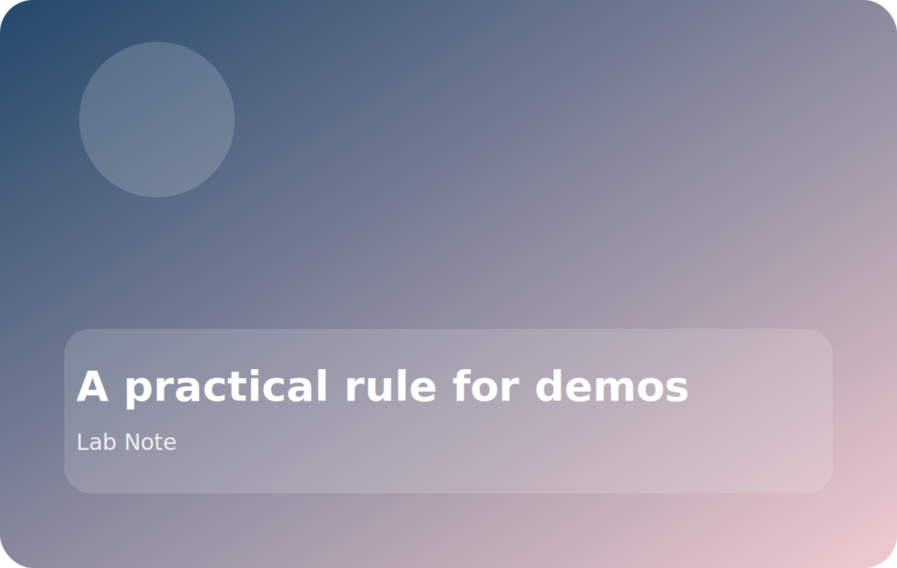

# A practical rule for demos

We use one simple rule before any public demo, open day, or benchmark-heavy presentation:

> If a number is important enough to appear on the slide, it should be repeatable on a clean setup.

That rule sounds strict, but it saves time. It prevents us from building a talk around a result that only works on one machine, one branch, or one lucky cache state.

## What we check before demo day

- Can we rerun the full command from scratch?
- Are the dependencies and model checkpoints documented?
- Do we know what the likely failure mode looks like?
- If the result is slower in a fresh environment, do we still understand why?

## Why this matters

Demo confidence is part of the research story. A polished figure is good, but a repeatable result is better because it makes follow-up work easier for everyone else in the group.

## Our fallback habit

If the full demo is fragile, we prepare a smaller version that still proves the key idea. That keeps the presentation honest and makes the live session much less stressful.
