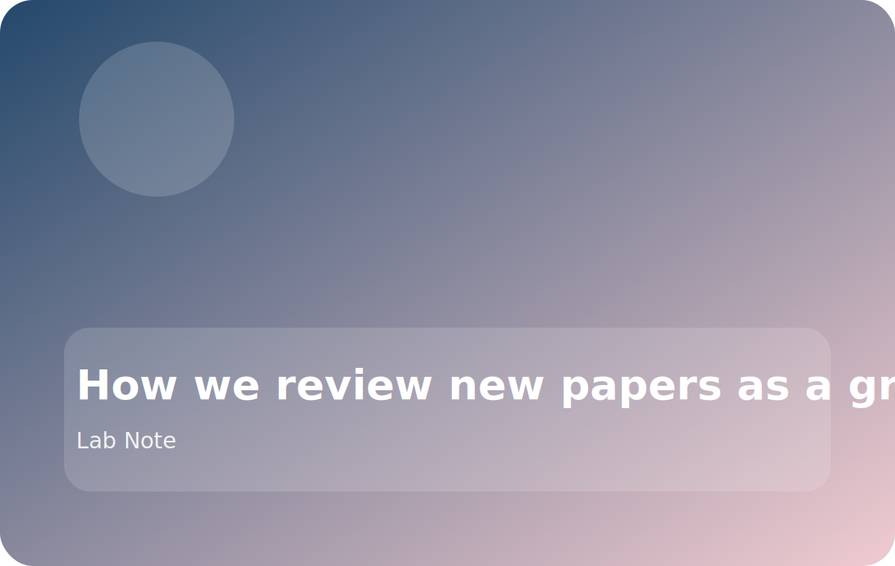

# How we review new papers as a group

When a new paper lands in our reading queue, we try to separate **what the method claims** from **what the experiments actually prove**. That sounds obvious, but writing the two down separately keeps the discussion concrete.

## The three questions we start with

1. What assumption does the method make about hardware, data, or model scale?
2. Which systems bottleneck is it really trying to remove?
3. What would we need to reproduce before trusting the headline result?

## Why we do it this way

Reading for assumptions first makes it easier to spot where a paper is strong and where the claims are narrower than the title suggests. It also helps us decide whether the right next step is:

- a reproduction attempt,
- a small ablation,
- or just a design lesson we should remember for future work.

## A practical checkpoint

Before we leave the discussion, we try to answer one more question:

> If we wanted to build on this paper next week, what exact figure, table, or missing implementation detail would block us first?

That single checkpoint keeps the conversation anchored to action instead of admiration.
