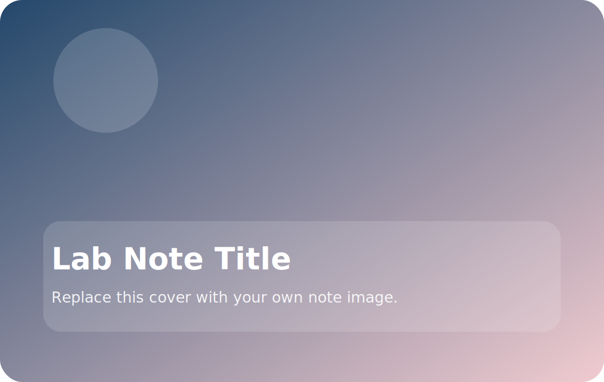

# Start with the main point

Use this Markdown file for the full article. The matching detail page lives at:

- `notes/<your-note-slug>/index.html`
- Markdown source: `notes/<your-note-slug>/index.md`
- Local images and PDFs: `notes/<your-note-slug>/assets/...`

## What to include

- A short opening summary
- One or two concrete lessons
- Images using standard Markdown syntax
- Links to papers, demos, or internal documents

## Suggested workflow

1. Copy `notes/template/` to `notes/<your-note-slug>/`.
2. Edit this Markdown file directly.
3. Replace `./assets/cover.svg` with your own cover image.
4. Update the matching note entry in `assets/js/data/site-content.js`.

> Keeping each note in its own folder makes it easy to drop in figures, PDFs, and screenshots later.
