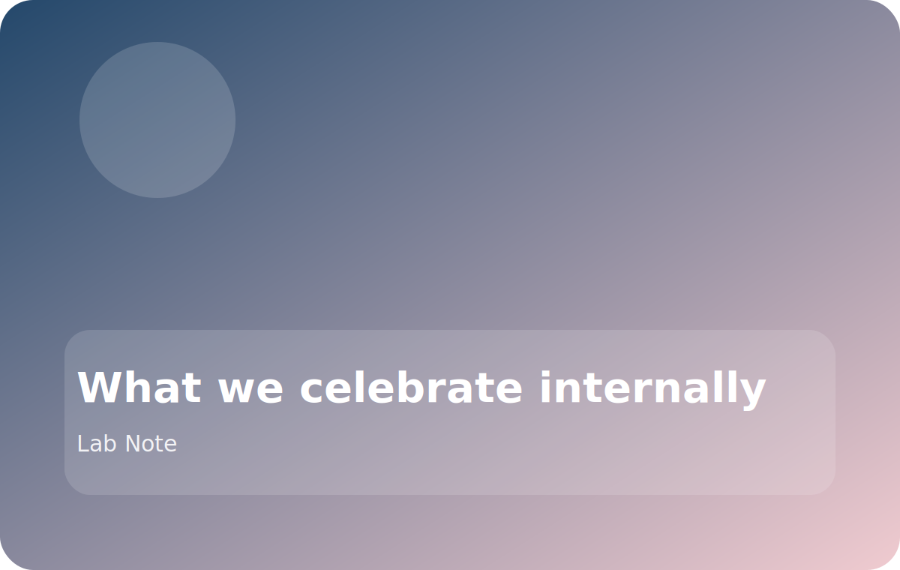

# What we celebrate internally

It is easy for a lab website to show only the visible milestones: accepted papers, awards, demos, and citations. Inside the group, though, we try to celebrate the quieter things too.

## The work that keeps projects healthy

- a reproducible experiment folder,
- a benchmark script someone else can trust,
- a thoughtful code review,
- or a careful handoff before a deadline.

## Why these moments matter

Those actions rarely appear on the title slide, but they directly affect whether the next student can build on the work without starting over.

## A culture checkpoint

When something goes well, we ask:

1. Did the result improve?
2. Did the codebase get easier to use?
3. Did the team become easier to collaborate with?

The third question is the one we most want to keep answering “yes” to.
