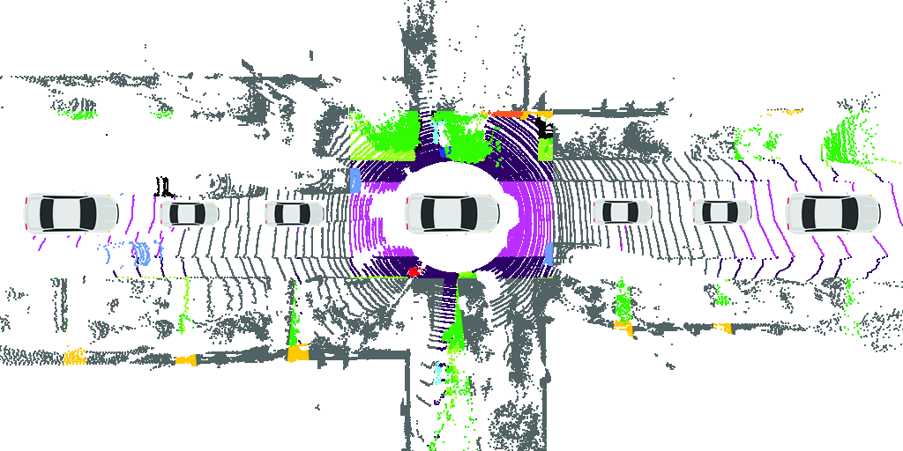
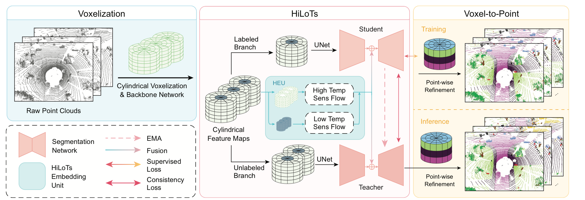
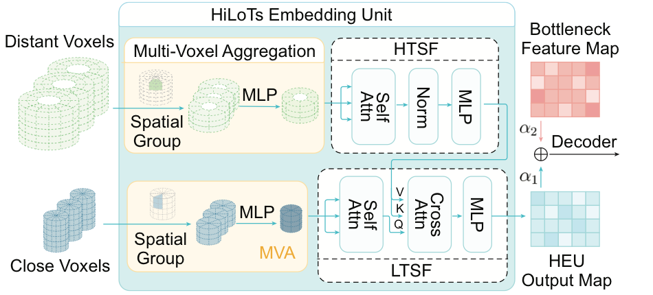
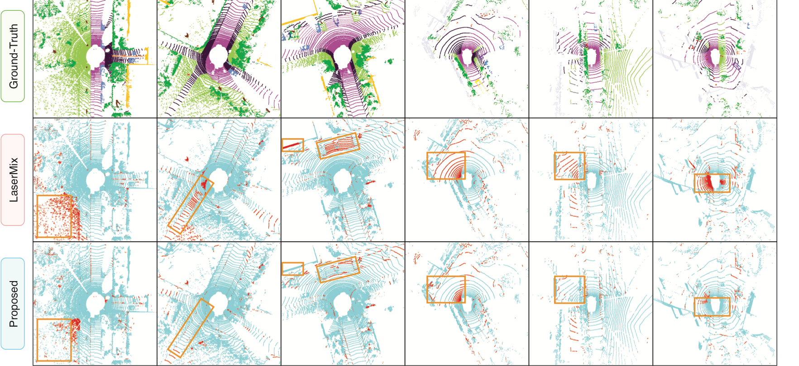

# Overview

LiDAR semantic segmentation is essential for autonomous driving, but dense point-wise annotation is expensive. HiLoTs addresses this with a semi-supervised setup that uses a small portion of labeled LiDAR frames together with many unlabeled frames.

The core observation is spatially intuitive: nearby regions such as road, sidewalk, and vehicles tend to remain relatively stable across consecutive driving frames, while distant regions such as vegetation, buildings, fences, and pedestrians change more rapidly in category and shape. HiLoTs converts this into a model design by learning **High Temporal Sensitivity Flow (HTSF)** for distant dynamic regions and **Low Temporal Sensitivity Flow (LTSF)** for nearby stable regions.

The institution field is abbreviated at the university level: **XJTU** and **ZJU**.

<figure class="markdown-figure">
  
  <figcaption>Figure 1. Nearby objects are less sensitive to temporal changes, while farther objects show stronger category and shape variation.</figcaption>
</figure>

## Method

HiLoTs has three stages:

- **Voxelization** converts unordered point clouds into cylindrical voxel grids, then extracts spatial features with a backbone network.
- **HiLoTs representation learning** uses a student-teacher semi-supervised framework and a HiLoTs Embedding Unit to model temporal sensitivity.
- **Voxel-to-point refinement** maps voxel-level predictions back to point-level semantic segmentation results.

The framework follows the Mean Teacher semi-supervised paradigm. Labeled frames train the student branch with supervised focal loss, while unlabeled frames are processed by the teacher branch and aligned through consistency loss. The teacher is updated by exponential moving average and is used during inference.

<figure class="markdown-figure">
  
  <figcaption>Figure 2. HiLoTs combines cylindrical voxelization, student-teacher semi-supervised training, temporal sensitivity modeling, and point-wise refinement.</figcaption>
</figure>

## HiLoTs Embedding Unit

The **HiLoTs Embedding Unit (HEU)** is the main architectural contribution. It separates far-range and near-range cylindrical voxel features before temporal modeling:

- **Multi-Voxel Aggregation (MVA)** groups neighboring voxels into super-voxels, reducing attention cost while preserving coherent local semantics.
- **HTSF** processes far-range voxels, where temporal and spatial changes are stronger.
- **LTSF** processes close-range voxels, where categories and shapes are more stable over time.
- **Cross-attention** lets high- and low-sensitivity representations interact before they are fused with the segmentation bottleneck feature map.

<figure class="markdown-figure">
  
  <figcaption>Figure 3. HEU explicitly models high- and low-temporal-sensitivity regions, then fuses them into the segmentation decoder.</figcaption>
</figure>

## Experimental Setup

HiLoTs is evaluated on two autonomous-driving LiDAR benchmarks:

| Dataset | Sensor / Scale | Classes | Evaluation Split |
| --- | --- | ---: | --- |
| SemanticKITTI | 64-beam Velodyne HDL-64E at 10 Hz; 19,120 training scenes | 19 | Sequence 08 validation set with 4,070 scenes |
| nuScenes | 32-beam Velodyne HDL-32E at 20 Hz; 27,287 training scenes | 16 | Validation set with 5,850 scenes |

The paper reports mean Intersection-over-Union (**mIoU**) under **1%**, **10%**, **20%**, and **50%** labeled-frame ratios. HiLoTs is trained for 50,000 iterations with AdamW, batch size 16 on four RTX 3090 GPUs. The temporal input length is set to **t = 5**, and the cylindrical voxel grid resolution is **240 x 180 x 20**.

## Main Results

HiLoTs is a LiDAR-only method, yet it performs competitively with LiDAR+Camera semi-supervised approaches while avoiding camera input and RGB annotation.

| Method | Modality | SemanticKITTI 1 / 10 / 20 / 50 | nuScenes 1 / 10 / 20 / 50 |
| --- | --- | ---: | ---: |
| Cylinder3D | LiDAR | 45.4 / 56.1 / 57.8 / 58.7 | 53.4 / 63.4 / 67.0 / 71.9 |
| LaserMix | LiDAR | 50.6 / 60.0 / 61.9 / 62.3 | 55.3 / 69.9 / 71.8 / 73.2 |
| DDSemi | LiDAR | 59.3 / 65.1 / 66.3 / 67.0 | 58.1 / 70.2 / 74.0 / 76.5 |
| FRNet | LiDAR | 55.8 / 64.8 / 65.2 / 65.4 | 61.2 / 72.2 / 74.6 / 75.4 |
| LaserMix++ | LiDAR+Camera | 63.2 / 67.5 / 67.7 / 68.6 | 65.3 / 75.3 / 75.2 / 76.3 |
| HiLoTs | LiDAR | 58.6 / 65.7 / 66.5 / 67.6 | 58.7 / 72.2 / 75.2 / 76.9 |

On SemanticKITTI, HiLoTs improves over strong LiDAR-only semi-supervised baselines at 10%, 20%, and 50% labeled ratios. On nuScenes, it reaches 76.9 mIoU at the 50% labeled ratio and remains close to LiDAR+Camera methods without using image data.

<figure class="markdown-figure">
  
  <figcaption>Figure 4. Error-map visualization shows that HiLoTs improves distant-object segmentation, where temporal variation is stronger.</figcaption>
</figure>

## Ablation Findings

The ablation study confirms that both high- and low-temporal-sensitivity modeling matter, with the complete HEU giving the strongest results.

| HEU Variant | SemanticKITTI 10 / 20 / 50 | nuScenes 10 / 20 / 50 |
| --- | ---: | ---: |
| None | 59.2 / 60.3 / 60.9 | 66.8 / 68.4 / 69.2 |
| HTSF only | 63.4 / 63.9 / 64.5 | 69.2 / 71.8 / 74.3 |
| LTSF only | 62.8 / 63.5 / 64.3 | 68.5 / 71.2 / 73.9 |
| Full HEU | 65.7 / 66.5 / 67.6 | 72.2 / 75.2 / 76.9 |

The fusion study also shows that cross-attention is better than simple addition or concatenation. Using the low-sensitivity flow as the query reaches the best overall configuration: **65.7 / 66.5 / 67.6** mIoU on SemanticKITTI and **72.2 / 75.2 / 76.9** on nuScenes under 10%, 20%, and 50% labels.

The Multi-Voxel Aggregation design is also important. Compared with random or density-based voxel selection, aggregation reaches **65.7 / 66.5 / 67.6** on SemanticKITTI and **72.2 / 75.2 / 76.9** on nuScenes, outperforming alternatives by roughly 2-3 mIoU in many settings.

## Resources

- Code: [https://github.com/rdlin118/HiLoTs](https://github.com/rdlin118/HiLoTs)
- Paper: [CVF Open Access PDF](https://openaccess.thecvf.com/content/CVPR2025/papers/Lin_HiLoTs_High-Low_Temporal_Sensitive_Representation_Learning_for_Semi-Supervised_LiDAR_Segmentation_CVPR_2025_paper.pdf)

## Citation

```bibtex
@inproceedings{lin2025hilots,
  title = {HiLoTs: High-Low Temporal Sensitive Representation Learning for Semi-Supervised LiDAR Segmentation in Autonomous Driving},
  author = {Lin, R. D. and Weng, Pengcheng and Wang, Yinqiao and Ding, Han and Han, Jinsong and Wang, Fei},
  booktitle = {Proceedings of the IEEE/CVF Conference on Computer Vision and Pattern Recognition},
  pages = {1429--1438},
  year = {2025}
}
```
