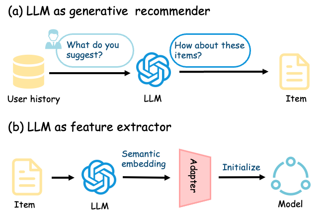
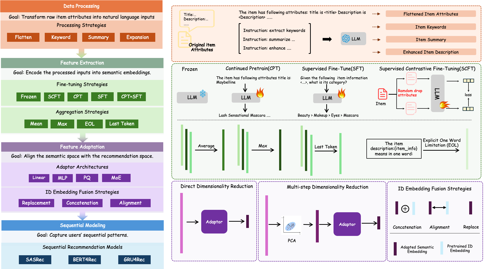
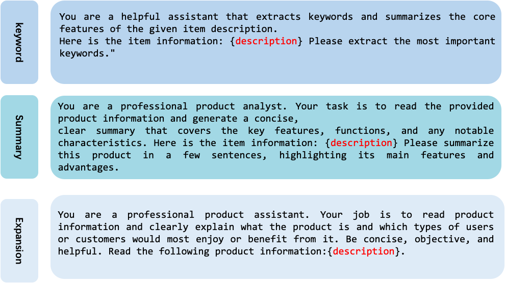
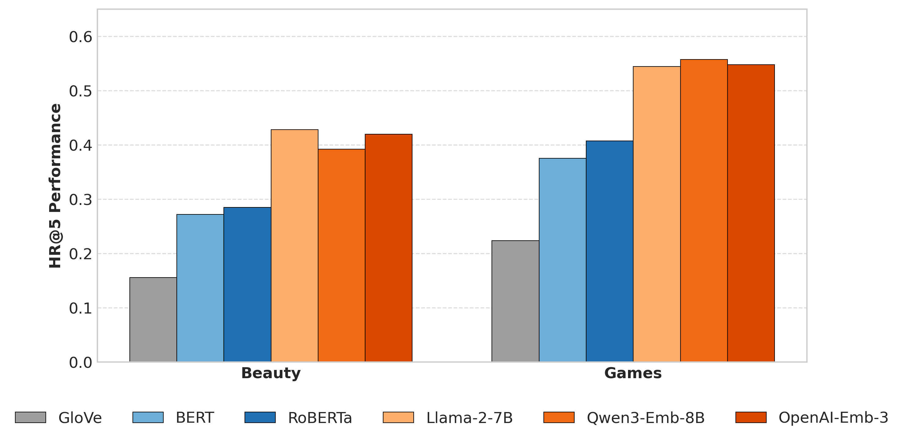

# Overview

This paper studies a practical way to use large language models in recommender systems: not as online generative recommenders, but as **offline feature extractors** that turn item metadata into semantic embeddings for conventional sequential recommenders. This paradigm is attractive because expensive LLM inference can be done offline, while online serving only needs cached embeddings and a lightweight recommendation model.

The challenge is that existing LLM-enhanced recommenders mix many design choices at once: prompt construction, LLM adaptation, token aggregation, dimensionality reduction, adapter architecture, and ID feature fusion. Because these choices are tightly coupled, it is hard to know which part truly improves recommendation quality.

The paper proposes **RecXplore**, a controlled modular diagnostic framework that decomposes the LLM-as-feature-extractor pipeline into four modules and evaluates representative choices in isolation. The headline finding is simple and useful: carefully combining robust design choices beats more complicated monolithic pipelines, reaching up to **18.7% relative improvement in NDCG@5** and **15.1% in HR@5** over strong baselines.

The institution field is abbreviated at the university level: **XJTU** and **HKUST(GZ)**.

<figure class="markdown-figure">
  
  <figcaption>Figure 1. The paper contrasts LLM-centric generation with the more deployment-friendly LLM-as-feature-extractor paradigm.</figcaption>
</figure>

## RecXplore Framework

RecXplore factorizes the pipeline into four modules:

- **Data Processing** converts item attributes such as title, brand, category, and description into natural language prompts.
- **Feature Extraction** uses an LLM to encode prompts into semantic item embeddings, while testing fine-tuning and token aggregation strategies.
- **Feature Adaptation** compresses high-dimensional LLM embeddings into the latent space required by sequential recommenders.
- **Sequential Modeling** evaluates the resulting representations inside standard backbones such as SASRec, BERT4Rec, and GRU4Rec.

This decomposition lets the paper ask a sharper question: if the experimental setup is controlled, which choices consistently help?

<figure class="markdown-figure">
  
  <figcaption>Figure 2. RecXplore evaluates each design dimension independently before assembling the best-performing configuration.</figcaption>
</figure>

## Design Space And Best Practices

| Module | Choices Studied | Main Finding |
| --- | --- | --- |
| Data processing | Attribute flattening, keyword extraction, summarization, knowledge expansion | Simple attribute flattening is the most robust prompt strategy. |
| Feature aggregation | Mean pooling, max pooling, last token, explicit one-word limitation | Mean pooling consistently works best by preserving distributed token evidence. |
| LLM adaptation | Frozen, CPT, SFT, SCFT, CPT+SFT | The two-stage CPT+SFT pipeline gives the most consistent gains. |
| Feature adaptation | Linear, MLP, PQ, MoE, with or without PCA | MoE is the strongest adapter; PCA+MoE is the best overall configuration. |
| ID fusion | Replace, concatenate, align semantic and ID embeddings | With a strong MoE adapter, directly replacing ID embeddings is usually optimal. |

The resulting optimized configuration uses flattened item attributes, mean pooling, CPT+SFT, PCA-enhanced MoE adaptation, and direct replacement of ID embeddings with semantic vectors.

<figure class="markdown-figure">
  
  <figcaption>Figure 3. The paper compares LLM-assisted prompt transformations against a simple flattened-attribute baseline.</figcaption>
</figure>

## Experimental Setup

The experiments use four public sequential recommendation benchmarks: **Beauty**, **Fashion**, and **Games** from Amazon product reviews, plus **Steam**. Evaluation uses **HR@5/10** and **NDCG@5/10**, with 100 randomly sampled uninteracted items per test instance and three random seeds.

The main configuration uses **LLaMA2-7B** as the feature extractor. LLM outputs are 4096-dimensional and can be reduced to 1536 dimensions with PCA before being projected into the 128-dimensional recommender space. Fine-tuning uses LoRA with rank 8 and scaling factor 32. Experiments were run on 8 NVIDIA L20 GPUs.

## Key Results

| Question | Representative Result |
| --- | --- |
| Does prompt rewriting help? | Attribute flattening reaches 0.5592 HR@5 and 0.7106 HR@10 on Steam, and is the most robust strategy overall. |
| Which aggregation strategy works best? | Mean pooling wins across all datasets; max pooling drops to 0.1801 HR@5 on Beauty, less than half of mean pooling. |
| Does LLM adaptation matter? | On Beauty, HR@5 rises from 0.4282 with a frozen LLM to 0.4812 with CPT+SFT. |
| Which adapter is strongest? | PCA+MoE reaches 0.6464 HR@5 on Games and 0.6227 HR@5 on Steam. |
| Are ID embeddings still needed? | With MoE, replacing ID embeddings with semantic embeddings is better than concatenation or alignment. |

Under the SASRec backbone, the final RecXplore configuration achieves:

| Dataset | HR@5 / HR@10 | NDCG@5 / NDCG@10 | Relative Gain Over Strongest Baseline |
| --- | ---: | ---: | --- |
| Beauty | 0.5066 / 0.6053 | 0.3957 / 0.4268 | +12.3% HR@5, +14.4% NDCG@5 |
| Games | 0.6464 / 0.7675 | 0.4896 / 0.5289 | +12.7% HR@5, +18.7% NDCG@5 |
| Fashion | 0.5544 / 0.6112 | 0.5088 / 0.5282 | +7.3% HR@5, +8.0% NDCG@5 |
| Steam | 0.6227 / 0.7683 | 0.4612 / 0.5062 | +7.2% HR@5, +7.0% NDCG@5 |

The improvements also hold when the optimized configuration is applied to GRU4Rec and BERT4Rec, suggesting that the design choices are not tied to a single downstream recommender.

<figure class="markdown-figure">
  
  <figcaption>Figure 4. Larger LLM-based feature extractors outperform static embeddings and small encoder-only models on Beauty and Games.</figcaption>
</figure>

## Efficiency And Deployment

RecXplore is designed for deployment-friendly recommendation. All semantic item embeddings are precomputed and cached offline, so the online system only performs standard lookup and lightweight recommendation inference. This means the stronger MoE adapter does not introduce extra online LLM latency.

The paper reports that, on Beauty with about 57k items, CPT+SFT adds about **45 minutes** of offline training compared with the **1.5-hour** frozen baseline. Feature generation with MoE adds only about **0.04 seconds** total overhead over a linear adapter for the full dataset. The trade-off is therefore concentrated offline, while online serving remains efficient.

## Resources

- Paper: [https://arxiv.org/abs/2509.14979](https://arxiv.org/abs/2509.14979)
- Code status: the PDF states that code will be released upon acceptance; no public code URL is provided in the paper.

## Citation

```bibtex
@article{shi2026what,
  title = {What Matters in LLM-Based Feature Extractor for Recommender? A Systematic Analysis of Prompts, Models, and Adaptation},
  author = {Shi, Kainan and Zhou, Peilin and Wang, Ge and Ding, Han and Wang, Fei},
  journal = {arXiv preprint arXiv:2509.14979},
  year = {2026},
  note = {Version 3, January 28, 2026}
}
```
